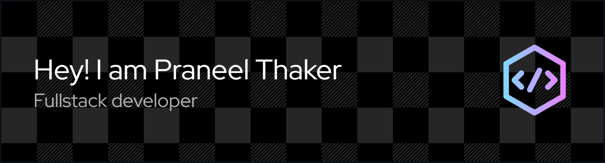

  

  <table>
    <tr>
      <td>
        <h1 align="left">Hi, I'm Praneel Thaker 👋</h1>
        <h3 align="left">A Passionate Software Developer specializing in Python and the MERN Stack.</h3>
        

          I am a passionate Software Developer with a strong interest in web technologies. I have over a year of experience specializing in Python and the MERN stack to build custom, responsive websites and e-commerce platforms. Proficient in both frontend and backend development, I also have experience with CMS solutions like WordPress and Shopify
        

        

          
          &nbsp;
          
          &nbsp;
          
        

      </td>
      <td width="400">
        
      </td>
    </tr>
  </table>

---

### 🚀 My Focus & Interests

* **Currently Exploring:** To further my goal of building scalable applications, I am diving deeper into cloud-native solutions and advanced serverless architectures to build more resilient and efficient systems.
  
* **Collaboration:** I am open to collaborating on innovative projects, especially those involving the MERN stack or Python. Let's connect if you're building custom e-commerce platforms or full-stack web applications.
  
* **Ask Me About:** Python , the MERN Stack (React, Node.js, MongoDB, Express) , Full-stack Development , CMS solutions like WordPress and Shopify , and building responsive e-commerce platforms
  
* **Get in Touch**: You can reach me via        &nbsp;&nbsp;  or find more details on my 

---

<h2 align="center">My Tech Stack & Tools</h2>

  Here are some of the technologies I've been working with recently:

<table align="center" width="100%">
  <tr>
    <td align="center" width="33%">
      <h3 align="center">Frontend</h3>
      

        
        
        
        
        
        
        
      

    </td>
    <td align="center" width="33%">
      <h3 align="center">Backend</h3>
      

        
        
        
        
        
        
      

    </td>
    <td align="center" width="33%">
      <h3 align="center">Databases</h3>
      

        
        
        
      

    </td>
  </tr>
  <tr>
    <td align="center" colspan="3">
      <h3 align="center">Tools, Platforms & Other</h3>
      

        
        
        
        
        
        
        
        
        
      

    </td>
  </tr>
</table>

---

<h2 align="center">My Most Used Technologies</h2>

  <em>This chart is dynamically generated from my GitHub repository activity.</em>

  

---

  

